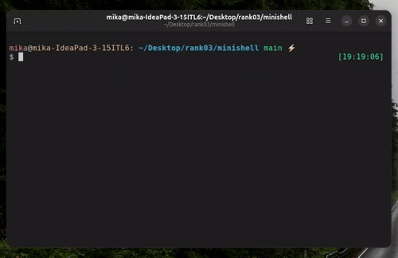

# *🐚 minishell*

Developed by [@MikAghumyan](https://github.com/MikAghumyan) and [@cppapooparot](https://github.com/cppapooparot)

<details>
<summary>Table of Contents</summary>

- [🐚 minishell](#minishell)
  - [Overview](#overview)
  - [Demo](#demo)
  - [Features](#features)
  - [Parsing & Expansion Flow](#parsing)
  - [Prerequisites](#prerequisites)
  - [Installation](#installation)
  - [Acknowledgments](#acknowledgments)

</details>

## 💡 Overview

Minishell is a minimal recreation of a UNIX command-line interpreter, developed in C as part of the [42 school](https://github.com/42school) curriculum. It provides a prompt where the user can type commands, execute programs, handle redirections, pipes, and builtins, just like in [bash](https://www.gnu.org/software/bash/bash.html).

## 🖥️ Demo


## ⚙️ Features
+ Display a prompt and read user input
+ Lexical analysis and syntax parsing
+ Execute commands with arguments and environment variables
+ Handle:
	- Pipes (|)
	- Redirections (>, >>, <, <<)
	- Quoting (' and ")
	- Environment variable expansion ($VAR, $?)
	- Exit statuses
+ Manage signals (Ctrl+C, Ctrl+D, Ctrl+\)
+ Execute builtins and external programs
+ Bonus features
    - Wildcard expansion (*)
    - Subshells and logical operators ((), &&, ||)
    - Export += syntax for appending to existing env vars

### 🏗️ Builtins Implemented
+ **`echo`** with -n option
+ **`cd`**
+ **`pwd`**
+ **`export`**
+ **`unset`**
+ **`env`**
+ **`exit`**

### 🛠️ Signals Handling

| Option | Description |
|:------ | -----------:|
| Ctrl+C (SIGINT)| Clears current input line, returns to prompt|
| Ctrl+D (EOF)|	Exits shell if line is empty|
|Ctrl+\ (SIGQUIT)|	Ignored in interactive mode, displayed in non-interactive|

### 🚨 Error & Memory Management
+ Detects and reports syntax errors:
	- unclosed quotes
	- invalid pipes or redirections
+ Gracefully handles command not found / permission denied
+ Propagates correct exit statuses
+ No memory leaks

## 🔄 Parsing & Expansion Flow
``` pgsql 
                ┌───────────────┐
                │   User Input  │
                └───────┬───────┘
                        ↓
                ┌───────────────┐
                │   Tokenizer   │
                └───────┬───────┘
                        ↓
                ┌───────────────┐
                │    Parser     │
                └───────┬───────┘
                        ↓
              ┌────────────────────┐
              │    Expander        │
              │  (vars, *, heredoc)│
              └─────────┬──────────┘
                        ↓
                ┌───────────────┐
                │   Executor    │
                └───────┬───────┘
                        ↓
                ┌───────────────┐
                │ Builtin/Execv │
                └───────────────┘

```
	
## 🧰 Prerequisites

### 🧱 System Requirements
+ Operating System: Linux (tested on Ubuntu 22.04 – 25.10, Android 15 (Termux))
+ Architecture: tested on x86_64 and arm64-v8a
+ Shell Environment: bash or compatible terminal (for running the binary)
+ Compiler: gcc (recommended: GCC 11+)
+ Make utility: make
+ Libraries:
	- GNU readline (libreadline-dev)
	- Standard C library (glibc)

### ⚙️ Install Dependencies (Ubuntu/Debian)
``` bash
sudo apt update
sudo apt install build-essential libreadline-dev
```

## 💽 Installation
```bash
git clone https://github.com/MikAghumyan/minishell.git
cd minishell
git submodule update --init libft
make
#make debug
#make termux
```

## 💡Acknowledgments

- **[42 school](https://github.com/42school)**: For providing the project framework and resources.
- **Community**: Thanks to peers for providing assistance and sharing knowledge.
- [@42school](https://github.com/42school) [@42paris](https://github.com/42paris) [@RubBarkhudaryan](https://github.com/RubBarkhudaryan) [@Davhak2](https://github.com/Davhak2) [@gnersisyann](https://github.com/gnersisyann) [@Kragline](https://github.com/Kragline) [@armannikoyan](https://github.com/armannikoyan) [@Patvakanyan](https://github.com/Patvakanyan)